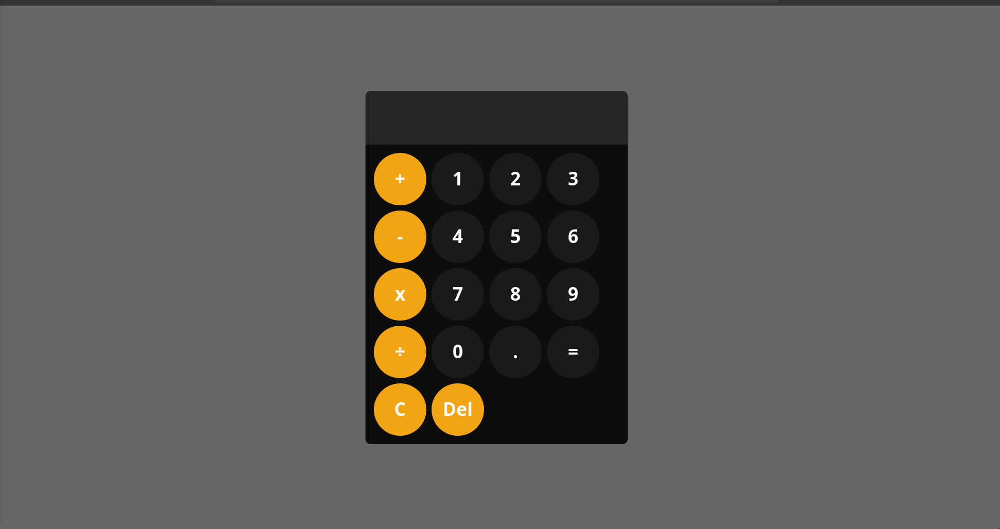

# Calculator

This is a simple calculator project built with HTML, CSS, and JavaScript. It provides basic arithmetic operations like addition, subtraction, multiplication, and division.

## Features

- User-friendly interface
- Basic arithmetic operations (addition, subtraction, multiplication, division)
- Clear button to reset the display
- Responsive design

## Demo

You can try out the live calculator here: [Live Site URL](https://calculator-blond-omega-43.vercel.app/)


## Screenshot
## Mobile-design


## Desktop-design

## Technologies Used

- HTML5
- CSS3
  - Flexbox
  - CSS Grid
  - Custom Properties
- JavaScript

## Getting Started

To get a local copy up and running, follow these steps:

1. **Clone the repository:**
   ```bash
   git clone https://github.com/ShelbyG2/calculator.git
   ```
